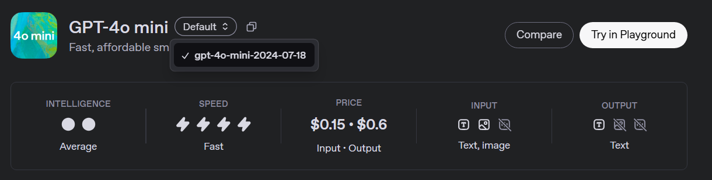

# image-llm
Script for LLM image inference

## Initial Setup

### Directory Structure
To make sure it's working properly, please structure your project following this tree
```
image-llm
├── dataset_bisindo_letters
│   ├── a
│   │   └── 1.png
│   ├── b
│   │   └── 1.jpg
│   └── c
│       └── 1.jpeg
│
└── predict.py
└── .env
```

### Environment file
```bash
OLLAMA_URL = <your-ollama-url>
OPENAI_API_KEY = <your-openai-api-key>
```

### Install requirements
It is advised to use python virtual environment
```bash
python3 -m venv <your-virtual-env-name>
source <your-virtual-env-name>/bin/activate
```

To install the requirements run this command:

```bash
pip install requirements.txt
```


## Usage
Run the script as follow
```bash
python predict.py --image-folder <path-to-dir> --llm-provider <llm-provider> --model <model-name> --output-file <path-to-file> --save-interval <save-result-every-N-image-(optional)>
```

Example:

```bash
python predict.py --image-folder dataset_bisindo_letters --llm-provider ollama --model llama3.2-vision:11b-instruct-fp16 --output-file hasil.xlsx
```

```bash
python predict.py --image-folder dataset_bisindo_letters --llm-provider openai --model gpt-4.1-nano --output-file hasil.xlsx --save-interval 10
```

### Model Availabilities
#### OpenAI
For OpenAI models, refer to this documentation: https://platform.openai.com/docs/models

<p align="center">
    
</p>

Look for models with image input capabilities. For model name use the `gpt-4o-mini-2024-07-18` or `gpt-4o-mini`. For more detailed model's naming, refer to this pricing documentation: https://platform.openai.com/docs/pricing

#### Ollama
Depends on what model hosted in the server. For model with vision capabilities, you can refer to this list: https://ollama.com/search?c=vision